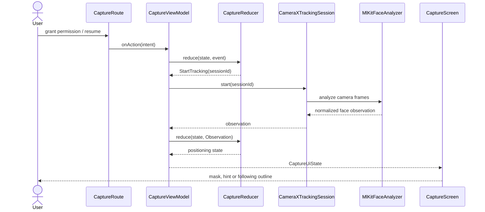

# High-level design

The application provides guided face positioning and live face following. It uses unidirectional data flow, constructor injection and strict layer boundaries inside one Android application module.

## Architecture

```text
UI action or platform event
             |
CaptureViewModel: serialized event processing
             |
CaptureReducer: state + event -> new state + commands
             |                              |
Immutable CaptureUiState             FaceTrackingPort
             |                              |
Lifecycle-aware Compose UI       CameraXTrackingSession
                                            |
                                    MlKitFaceAnalyzer
```

### Presentation

- `CaptureRoute` owns lifecycle and permission integration and hosts the camera preview bridge.
- `CaptureScreen` renders immutable state and emits `CaptureIntent` actions.
- `CaptureViewModel` translates actions and port results into domain events, executes commands once and publishes one read-only state flow.
- `PositioningMask` renders the initial oval and the live face outline.

### Domain

- `CaptureReducer` is the deterministic session state machine.
- `PositioningPolicy` decides alignment hints, the stable hold interval and transition into face following.
- `QualityEvaluator`, `MovementEvaluator`, `GuidancePolicy` and image metrics provide deterministic guidance checks.
- `FaceTrackingPort` and `CaptureClock` isolate the domain from Android and SDK APIs.

### Infrastructure

- `CameraXTrackingSession` owns CameraX binding, lifecycle cleanup, observation delivery and stale-analysis recovery.
- `MlKitFaceAnalyzer` runs face detection and maps SDK coordinates into the normalized mirrored preview space.
- `AndroidCaptureClock` supplies monotonic timestamps.

### Composition root

`CaptureGraph` constructs the infrastructure and presentation objects and supplies the narrow preview bridge. `MainActivity` remains the entry point.

## Runtime sequence



## Reliability rules

- The main dispatcher serializes state transitions.
- Every monitoring attempt has a monotonically increasing session ID.
- Obsolete callbacks and non-increasing timestamps are ignored.
- High-frequency observations may be conflated; camera failures use a reliable path.
- Face geometry is expressed in normalized mirrored-preview coordinates.
- Tracking success, visual smoothing and guidance decisions remain separate.

## Verification

- JVM tests cover reducer transitions, stale callbacks, session resets, positioning, movement and guidance decisions.
- `assembleDebug` verifies Android compilation and packaging.
- Real-device checks cover preview alignment, tracking loss/recovery, rotation/mirroring, lifecycle changes and camera failure recovery.
