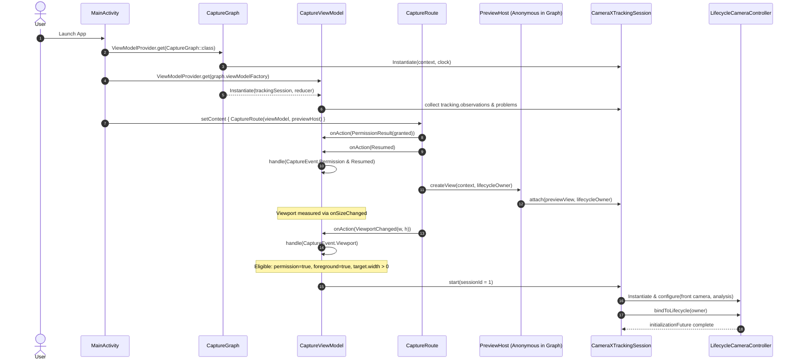
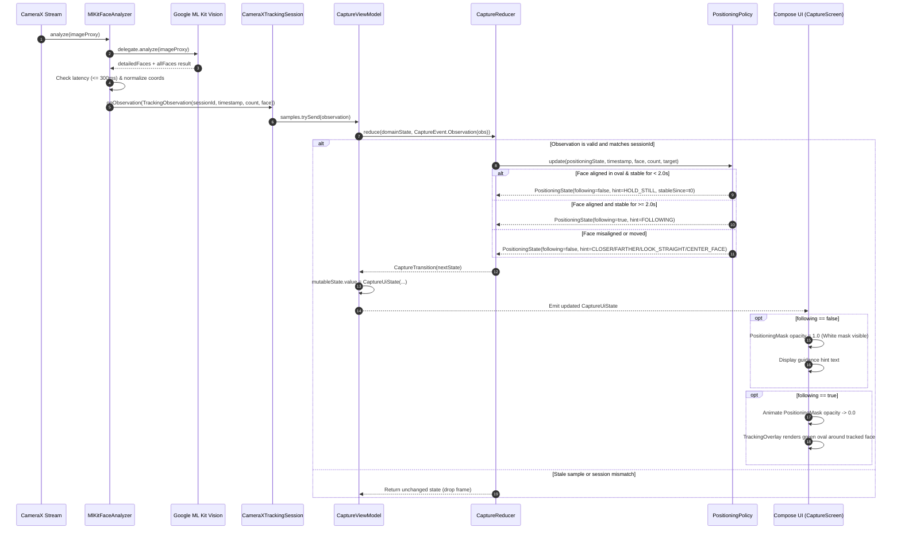
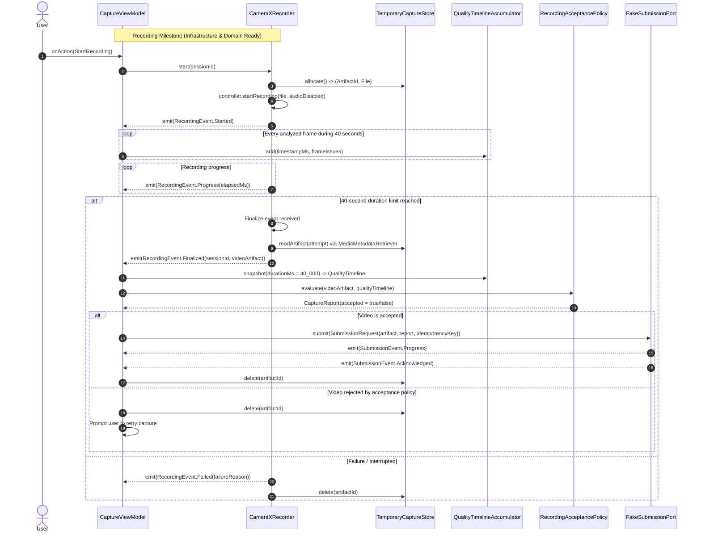

# High-Level Design (HLD) & Class Relationships

This document provides a comprehensive High-Level Design (HLD) of the **Facial Video Capture & Tracking** system, detailing its architectural principles, class relationships, and runtime sequence diagrams using Mermaid.

---

## 1. Architectural Overview

The application follows **Clean Architecture / Ports and Adapters (Hexagonal Architecture)** combined with **Unidirectional Data Flow (UDF / MVI)** and strict **Single Responsibility Principle (SRP)**:

```text
       ┌─────────────────────────────────────────────────────────────┐
       │                       Presentation                          │
       │   CaptureRoute ──► CaptureScreen ──► (Mask & Overlay UI)     │
       │         │                                                   │
       │   CaptureIntent                                             │
       │         ▼                                                   │
       │   CaptureViewModel ─────── StateFlow<CaptureUiState> ───────┘
       └─────────┬───────────────────────────────────────────────────┘
                 │ (translates Intent to Event)
                 ▼
       ┌─────────────────────────────────────────────────────────────┐
       │                          Domain                             │
       │             CaptureReducer (Pure State Machine)             │
       │                  │                    │                     │
       │        PositioningPolicy       Quality Policies             │
       │                  │                                          │
       │           CaptureCommand                                    │
       │                  ▼                                          │
       │           Domain Ports (Interfaces):                        │
       │           - FaceTrackingPort    - RecordingPort             │
       │           - CaptureClock        - ArtifactStore             │
       │           - SubmissionPort                                  │
       └──────────────────▲──────────────────────────────────────────┘
                          │ (implements)
       ┌──────────────────┴──────────────────────────────────────────┐
       │                      Infrastructure                         │
       │   CameraXTrackingSession ──► MlKitFaceAnalyzer              │
       │   CameraXRecorder        ──► TemporaryCaptureStore          │
       │   FakeSubmissionPort     ──► AndroidCaptureClock            │
       └──────────────────▲──────────────────────────────────────────┘
                          │ (wires)
       ┌──────────────────┴──────────────────────────────────────────┐
       │                     Composition Root                        │
       │   MainActivity ──► CaptureGraph ──► PreviewHost Bridge      │
       └─────────────────────────────────────────────────────────────┘
```

### Architectural Boundaries & Invariants
1. **Domain Layer**: Zero dependencies on Android, CameraX, ML Kit, UI frameworks, or `java.io`. Contains pure business models, deterministic MVI reducers, mathematical quality evaluators, and abstract port interfaces.
2. **Presentation Layer**: Depends solely on `domain` and Android Compose/Lifecycle. It never imports `infrastructure` or `di`. Interacts with camera preview exclusively through the [PreviewHost](file:///Users/nidhigupta/AndroidStudioProjects/facetracking/app/src/main/java/com/xim/facetracking/presentation/PreviewHost.kt) bridge.
3. **Infrastructure Layer**: Implements the domain ports using concrete platform libraries (CameraX, Google ML Kit, Android File System, System Clock).
4. **DI / Composition Root**: [CaptureGraph](file:///Users/nidhigupta/AndroidStudioProjects/facetracking/app/src/main/java/com/xim/facetracking/di/CaptureGraph.kt) retains non-activity infrastructure instances across configuration changes, supplies ViewModel factories, and bridges the CameraX preview to Compose.

---

## 2. Class Relationships (HLD Class Diagram)

The diagram below illustrates the classes, interfaces, and their relationships across all layers.

```mermaid
classDiagram
    direction TB

    %% Presentation Layer
    namespace Presentation {
        class MainActivity {
            +onCreate(savedInstanceState)
        }
        class CaptureRoute {
            +CaptureRoute(viewModel, previewHost)
        }
        class CaptureScreen {
            +CaptureScreen(state, onAction, ...)
            +TrackingOverlay(state)
        }
        class PositioningMask {
            +PositioningMask(visible)
        }
        class PreviewHost {
            <<interface>>
            +createView(context, owner) View
            +release(view)
        }
        class CaptureViewModel {
            -domainState: CaptureState
            -mutableState: MutableStateFlow~CaptureUiState~
            +state: StateFlow~CaptureUiState~
            +onAction(intent: CaptureIntent)
            -handle(event: CaptureEvent)
        }
        class CaptureIntent {
            <<sealed interface>>
            +PermissionResult(granted)
            +ViewportChanged(width, height)
            +Resumed
            +Stopped
            +Retry
        }
        class CaptureUiState {
            +permissionGranted: Boolean
            +showPositioningMask: Boolean
            +hint: PositioningHint
            +trackedFace: PositioningFace?
            +failure: CameraFailure?
        }
    }

    %% Composition Root
    namespace CompositionRoot {
        class CaptureGraph {
            -tracking: CameraXTrackingSession
            +viewModelFactory: Factory
            +previewHost: PreviewHost
            +onCleared()
        }
    }

    %% Domain Layer
    namespace Domain {
        class FaceTrackingPort {
            <<interface>>
            +observations: Flow~TrackingObservation~
            +problems: Flow~CameraProblem~
            +start(sessionId: Long)
            +stop()
        }
        class CaptureClock {
            <<interface>>
            +monotonicMs() Long
            +wallTimeMs() Long
        }
        class RecordingPort {
            <<interface>>
            +events: Flow~RecordingEvent~
            +start(sessionId: String)
            +cancel()
        }
        class ArtifactStore {
            <<interface>>
            +exists(id: ArtifactId) Boolean
            +delete(id: ArtifactId)
            +cleanupExpired()
        }
        class SubmissionPort {
            <<interface>>
            +submit(request: SubmissionRequest) Flow~SubmissionEvent~
        }
        class CaptureReducer {
            -positioningPolicy: PositioningPolicy
            +reduce(state: CaptureState, event: CaptureEvent) CaptureTransition
        }
        class PositioningPolicy {
            +update(state, now, face, count, target) PositioningState
        }
        class QualityEvaluator {
            -spec: CaptureSpec
            +evaluate(observation: FrameObservation) List~QualityIssue~
        }
        class QualityTimelineAccumulator {
            +add(timestampMs, issues)
            +snapshot(durationMs) QualityTimeline
        }
        class RecordingAcceptancePolicy {
            +evaluate(artifact, timeline) CaptureReport
        }
        class CaptureState {
            +permissionGranted: Boolean
            +foreground: Boolean
            +target: PositioningTarget
            +sessionId: Long
            +monitoring: Boolean
            +positioning: PositioningState
            +face: PositioningFace?
            +failure: CameraFailure?
        }
        class CaptureTransition {
            +state: CaptureState
            +commands: List~CaptureCommand~
        }
    }

    %% Infrastructure Layer
    namespace Infrastructure {
        class AndroidCaptureClock {
            +monotonicMs() Long
            +wallTimeMs() Long
        }
        class CameraXTrackingSession {
            -samples: Channel~TrackingObservation~
            -failures: Channel~CameraProblem~
            -controller: LifecycleCameraController
            -analyzer: MlKitFaceAnalyzer
            +attach(view, owner)
            +detach(view)
            +start(sessionId)
            +stop()
        }
        class MlKitFaceAnalyzer {
            -detailed: FaceDetector
            -multiple: FaceDetector
            -delegate: MlKitAnalyzer
            +analyze(image: ImageProxy)
            +close()
        }
        class CameraXRecorder {
            -controller: LifecycleCameraController
            -store: TemporaryCaptureStore
            +start(sessionId)
            +cancel()
        }
        class TemporaryCaptureStore {
            +allocate() Pair~ArtifactId, File~
            +resolve(id) File
            +delete(id)
        }
        class FakeSubmissionPort {
            +submit(request) Flow~SubmissionEvent~
        }
    }

    %% Connections
    MainActivity ..> CaptureGraph : retrieves from ViewModelProvider
    MainActivity ..> CaptureRoute : sets content
    CaptureGraph *-- CameraXTrackingSession : owns
    CaptureGraph ..|> PreviewHost : implements via anonymous object
    CaptureGraph ..> CaptureViewModel : instantiates
    CaptureRoute --> CaptureViewModel : collects state & dispatches intents
    CaptureRoute --> CaptureScreen : renders
    CaptureScreen --> PositioningMask : renders cutout
    CaptureViewModel --> FaceTrackingPort : listens & commands
    CaptureViewModel --> CaptureReducer : executes transitions
    CaptureViewModel ..> CaptureIntent : accepts
    CaptureViewModel ..> CaptureUiState : exposes

    CaptureReducer --> PositioningPolicy : delegates geometry & stability
    CaptureReducer ..> CaptureState : transitions
    CaptureReducer ..> CaptureTransition : returns

    CameraXTrackingSession ..|> FaceTrackingPort : implements
    AndroidCaptureClock ..|> CaptureClock : implements
    CameraXTrackingSession *-- MlKitFaceAnalyzer : manages
    CameraXTrackingSession --> CaptureClock : checks timestamps
    MlKitFaceAnalyzer --> CaptureClock : measures frame freshness

    CameraXRecorder ..|> RecordingPort : implements
    TemporaryCaptureStore ..|> ArtifactStore : implements
    FakeSubmissionPort ..|> SubmissionPort : implements
    CameraXRecorder --> TemporaryCaptureStore : stores video files
    RecordingAcceptancePolicy ..> QualityTimelineAccumulator : inspects timeline
```



---

## 3. Detailed Component Map

| Layer                 | Component                | Source File                                                                                                                                                                                                                                                                                                                  | Responsibility                                                                                                                                              |
|-----------------------|--------------------------|------------------------------------------------------------------------------------------------------------------------------------------------------------------------------------------------------------------------------------------------------------------------------------------------------------------------------|-------------------------------------------------------------------------------------------------------------------------------------------------------------|
| **DI**                | `CaptureGraph`           | [CaptureGraph.kt](file:///Users/nidhigupta/AndroidStudioProjects/facetracking/app/src/main/java/com/xim/facetracking/di/CaptureGraph.kt)                                                                                                                                                                                     | Composition root retaining infrastructure services (`CameraXTrackingSession`), creating `CaptureViewModel`, and exposing the `PreviewHost` bridge.          |
| **Presentation**      | `MainActivity`           | [MainActivity.kt](file:///Users/nidhigupta/AndroidStudioProjects/facetracking/app/src/main/java/com/xim/facetracking/MainActivity.kt)                                                                                                                                                                                        | Application entry point and lifecycle host; wires `CaptureGraph` to Compose.                                                                                |
| **Presentation**      | `CaptureRoute`           | [CaptureRoute.kt](file:///Users/nidhigupta/AndroidStudioProjects/facetracking/app/src/main/java/com/xim/facetracking/presentation/CaptureRoute.kt)                                                                                                                                                                           | Bridges Android lifecycle (`ON_RESUME`, `ON_STOP`), camera permissions, and `PreviewView` embedding into Compose.                                           |
| **Presentation**      | `CaptureViewModel`       | [CaptureViewModel.kt](file:///Users/nidhigupta/AndroidStudioProjects/facetracking/app/src/main/java/com/xim/facetracking/presentation/CaptureViewModel.kt)                                                                                                                                                                   | MVI ViewModel: consumes `CaptureIntent`, invokes `CaptureReducer` on the Main dispatcher, emits `CaptureUiState`, and dispatches `CaptureCommand` to ports. |
| **Presentation**      | `CaptureScreen`          | [CaptureScreen.kt](file:///Users/nidhigupta/AndroidStudioProjects/facetracking/app/src/main/java/com/xim/facetracking/presentation/CaptureScreen.kt)                                                                                                                                                                         | Composable rendering camera preview, guidance prompt banner, error dialogs, and tracking overlays.                                                          |
| **Presentation**      | `PositioningMask`        | [PositioningMask.kt](file:///Users/nidhigupta/AndroidStudioProjects/facetracking/app/src/main/java/com/xim/facetracking/presentation/PositioningMask.kt)                                                                                                                                                                     | Renders the centered white oval cutout mask during the alignment phase, fading out when face following begins.                                              |
| **Domain**            | `CaptureContract`        | [CaptureContract.kt](file:///Users/nidhigupta/AndroidStudioProjects/facetracking/app/src/main/java/com/xim/facetracking/domain/CaptureContract.kt)                                                                                                                                                                           | Core contracts: `FaceTrackingPort`, `TrackingObservation`, `CaptureState`, `CaptureEvent`, and `CaptureCommand`.                                            |
| **Domain**            | `CaptureReducer`         | [CaptureReducer.kt](file:///Users/nidhigupta/AndroidStudioProjects/facetracking/app/src/main/java/com/xim/facetracking/domain/CaptureReducer.kt)                                                                                                                                                                             | Pure deterministic state reducer for capture session eligibility, session ID incrementation, and command issuance.                                          |
| **Domain**            | `PositioningPolicy`      | [PositioningPolicy.kt](file:///Users/nidhigupta/AndroidStudioProjects/facetracking/app/src/main/java/com/xim/facetracking/domain/PositioningPolicy.kt)                                                                                                                                                                       | Evaluates face alignment (center, distance, Euler angles), verifies 2-second stability without movement, and triggers `FOLLOWING`.                          |
| **Domain (Deferred)** | Quality & Acceptance     | [QualityEvaluator.kt](file:///Users/nidhigupta/AndroidStudioProjects/facetracking/app/src/main/java/com/xim/facetracking/domain/QualityEvaluator.kt), [RecordingAcceptancePolicy.kt](file:///Users/nidhigupta/AndroidStudioProjects/facetracking/app/src/main/java/com/xim/facetracking/domain/RecordingAcceptancePolicy.kt) | Image quality metric verification (luma, sharpness, regional checks), timeline accumulation, and 40s recording acceptance criteria.                         |
| **Infrastructure**    | `CameraXTrackingSession` | [CameraXTrackingSession.kt](file:///Users/nidhigupta/AndroidStudioProjects/facetracking/app/src/main/java/com/xim/facetracking/infrastructure/camera/CameraXTrackingSession.kt)                                                                                                                                              | Manages `LifecycleCameraController`, attaches `PreviewView`, runs watchdog timer (300ms stale observation recovery), and broadcasts observations.           |
| **Infrastructure**    | `MlKitFaceAnalyzer`      | [MlKitFaceAnalyzer.kt](file:///Users/nidhigupta/AndroidStudioProjects/facetracking/app/src/main/java/com/xim/facetracking/infrastructure/analysis/MlKitFaceAnalyzer.kt)                                                                                                                                                      | Adapter executing dual ML Kit face detectors (detailed accurate + multi-face fast), mapping coordinates to view dimensions.                                 |

---

## 4. Sequence Diagrams

### Sequence Diagram 1: Application Startup, Lifecycle, and Camera Attachment

Shows the orchestration from activity launch through dependency injection, permission validation, view binding, and camera initialization.



---

### Sequence Diagram 2: Frame Analysis, Positioning Decision, and MVI Loop

Shows the high-frequency observation pipeline from camera frame capture through ML Kit analysis, temporal positioning evaluation, and UI updates.



---

### Sequence Diagram 3: Deferred Recording, Acceptance & Submission Pipeline

Shows the architectural design for the full 40-second recording milestone, quality evaluation, local storage, and server submission.



---

## 5. Summary of Key Design Patterns

1. **Unidirectional Data Flow (UDF)**:
   All events (`CaptureIntent` / `CaptureEvent`) pass through `CaptureViewModel` and are reduced on the main dispatcher by the pure `CaptureReducer`.
2. **Ports and Adapters**:
   CameraX and ML Kit are strictly encapsulated behind `FaceTrackingPort` and `PreviewHost`. Domain logic has zero platform coupling, allowing 100% pure unit testability of reducers, geometric policies, and quality models on the JVM.
3. **Monotonic Session Tokenization & Watchdog**:
   `sessionId` and generation tokens ensure stale frame callbacks, background threads, and re-bind operations can never leak or corrupt the active session state. If analysis hangs for >300ms, a watchdog emits empty tracking observations to preserve timeline integrity.
