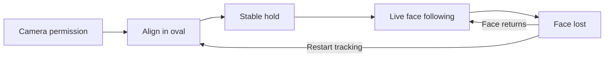

# Guided face tracking for Android

A live front-camera experience that helps the user position their face, follows it as they move, and provides corrective positioning and lighting guidance. Runs on Android 7.0+ in portrait orientation.

## See it in action

Actual app screenshots from a Samsung Galaxy S24 (SM-S921B), captured on 20 September 2026.

| 1. Align your face | 2. Live tracking and guidance | 3. Recover from tracking loss |
| :---: | :---: | :---: |
|  |  |  |
| The white mask guides alignment; the lighting indicator shows current conditions. | After a stable hold, the mask clears and a green outline follows the face. Position, distance and head-angle prompts remain active. | A return outline stays visible. Returning the face resumes tracking; **Restart tracking** starts alignment again. |

Lighting guidance also identifies low light, excessive brightness and uneven illumination, with left/right correction prompts. Positioning success is not a validated image-quality or identity check.

## Critical implementation details

- **Kotlin + Jetpack Compose** render immutable UI state; **CameraX + on-device ML Kit** provide the preview and face observations.
- **Unidirectional data flow:** UI actions and camera events enter the ViewModel, a pure domain reducer decides state and commands, and the UI renders the result. Camera lifecycle, detection, guidance and overlay rendering have separate responsibilities, wired through constructor injection.
- **Reliable session handling:** serialized transitions, increasing session IDs and timestamp checks reject obsolete callbacks. Camera frames are not logged or persisted by the app.
- **Current timing discrepancy:** the implementation uses a **1-second** stable hold; [the project guide](AGENTS.md) specifies **2 seconds**. This documentation update preserves existing behavior.

## Verification

Built and launched on the Galaxy S24 running Android 16. Screenshots show real camera alignment, tracking with corrective guidance, and tracking loss.

| Check | Result |
| --- | --- |
| `./gradlew assembleDebug` | Passed |
| `./gradlew testDebugUnitTest` | 27 tests passed |
| `./gradlew connectedDebugAndroidTest` | 7 tests passed |

Automatic recovery, lighting transitions and mirror/crop/rotation accuracy still need dedicated real-device acceptance checks; screenshots alone do not verify them.

To run locally, open the project in Android Studio, select a device with a front camera, run `app`, and grant camera access.
